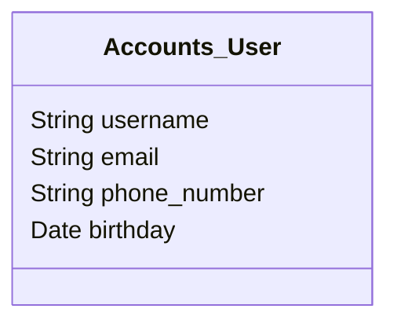

# Django Custom User Model

이 글에서는 Django에서 제공하는 기본 User 모델을 확장하여 사용자 정의 User 모델을 만드는 방법에 대해 알아보겠습니다.

Django는 기본적으로 `User` 모델을 제공합니다. 그러나 많은 경우에 개발자는 추가 필드나 기능이 필요할 수 있습니다. 이럴 때 Django의 기본 `User` 모델을 확장하여 사용자 정의 `User` 모델을 만들 수 있습니다.

## 사용자 정의 User 모델 만들기

먼저, `accounts` 앱을 만들고 `models.py` 파일을 열어 다음과 같이 작성합니다.

```python
from django.contrib.auth.models import AbstractUser
from django.db import models

class CustomUser(AbstractUser):
    phone_number = models.CharField(max_length=20, blank=True, null=True)
    birthday = models.DateField(blank=True, null=True)

    def __str__(self):
        return self.username

```

`CustomUser` 모델은 `AbstractUser`를 상속받아 `Django`의 기본 User 모델을 확장합니다. 여기에서는 `phone_number`와 `birthday` 필드를 추가했습니다.

## 사용자 정의 User 모델 설정하기

다음으로, `Django` 프로젝트의 `settings.py` 파일에서 `AUTH_USER_MODEL` 설정을 수정해야 합니다.

```python
# config > settings.py
AUTH_USER_MODEL = 'accounts.CustomUser'
```

이렇게 하면 Django에서 사용자 정의 User 모델을 사용하게 됩니다.

사용자 정의 User 모델 구조
사용자 정의 User 모델의 구조를 Mermaid 다이어그램으로 표현하면 다음과 같습니다.



이 다이어그램에서 볼 수 있듯이, 사용자 정의 User 모델은 Django의 기본 User 모델에서 제공하는 username과 email 필드 외에도 phone_number와 birthday 필드를 가지고 있습니다.

사용자 정의 User 모델을 만들고 설정하는 방법에 대해 알아보았습니다. 이렇게 하면 애플리케이션의 요구사항에 맞게 User 모델을 확장할 수 있습니다.

...
